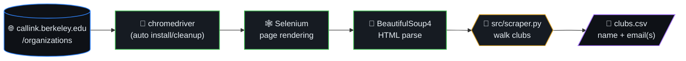
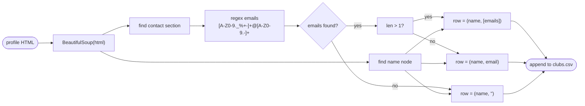
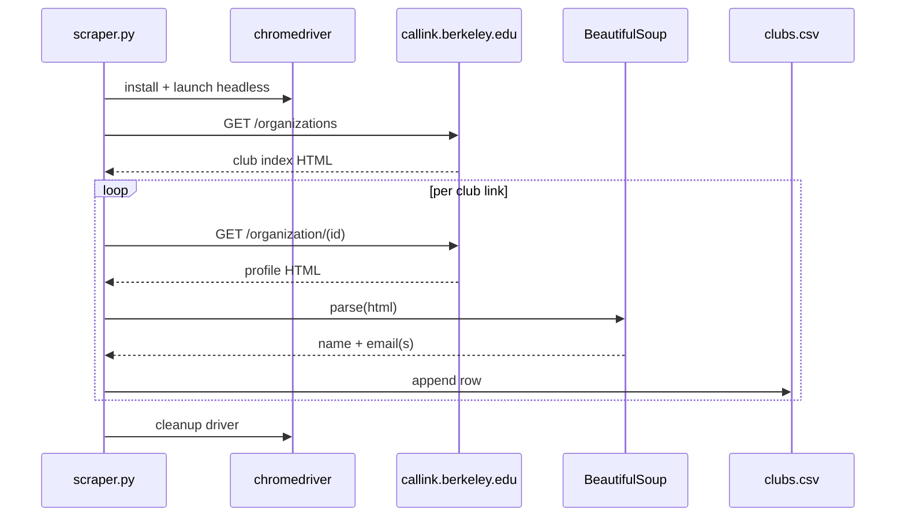
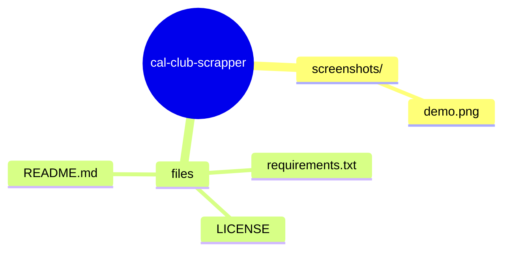

# CalClubScraper

> Scrapes all the emails of UC Berkeley's (Cal) student organizations
> (clubs). Outputs a CSV of clubs and contact email(s) per club.
> Powered by [Selenium](https://www.selenium.dev/documentation/) and
> [BeautifulSoup4](https://www.crummy.com/software/BeautifulSoup/bs4).

## Table of contents

- [Output sample](#output-sample)
- [Scrape loop (sequence)](#scrape-loop-sequence)
- [Parse algorithm](#parse-algorithm)
- [Runtime Environment](#runtime-environment)
- [Installation Steps](#installation-steps)
- [Running the Scraper](#running-the-scraper)
- [Sources](#sources)
- [🗺️ Repository map](#️-repository-map)

## Parse algorithm

## Scrape loop (sequence)

## Output sample

*Note: If there are more than 1 email, the entry is returned as a list of emails.*

---
## Runtime Environment
CalClubScraper runs using `pip3` packages. You also would need Python 3.6+ `chromedriver` may be flagged by the security system of platforms like MacOS, causing the program to crash. All you need to do: go to Security Preferences and click "Allow" to open the chromedriver executable. *Note: `chromedriver` is installed and deleted automatically by the program at runtime.

---
## Installation Steps 
1. If you have not already, install [`Python 3.6+`](https://www.python.org/downloads/)
2. Install all `pip3` required packages by running `pip3 install -r requirements.txt` in command line.

---
## Running the Scraper
To run the scraper, you can run the `scraper.py` script by typing `python3 src/scraper.py` in your terminal (from the root directory). Follow the status messages! *It may take a while*

Can change the endpoint URL being scraped. Simply go to https://callink.berkeley.edu/organizations and select an option (in the dropdown to the left) to filter the clubs you would like to scrape.

---
## Sources
* BeautifulSoup4 documentation: https://www.crummy.com/software/BeautifulSoup/bs4/doc/ 
* Selenium documentation: https://selenium-python.readthedocs.io/ 
* Website scraped: https://callink.berkeley.edu/ 

## 🗺️ Repository map

Top-level layout of `cal-club-scrapper` rendered as a Mermaid mindmap (auto-generated from the on-disk tree).

